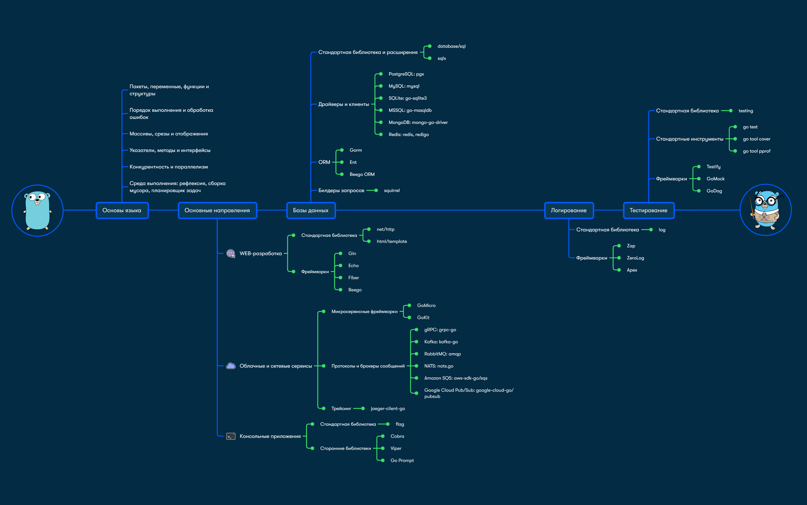

# give me a star please! ⭐ 
if you using this project for learning go, or chose a roadmap from here, thanks!

#### 🇷🇺: это - roadmap по golang! Roadmap наглядно показывает стратегию достижения той или иной цели, будь то реализация проекта, развитие бизнеса, создание и продвижение продукта, обучение.

#### eng: this is the golang roadmap! Roadmap clearly shows the strategy for achieving a particular goal, be it project implementation, business development, product creation and promotion, training.

## 🇷🇺: roadmap'ы составлены не мной, а лишь собраны здесь, дял наглядного понимания и возможности выбора наиудобнейшего для себя

## eng: The roadmaps were not compiled by me, but are only collected here for visual understanding and the ability to choose the most convenient one for yourself

Официальные источники: (Official sources)
1. https://github.com/darius-khll/golang-developer-roadmap/blob/master/ReadMe.md

2. https://roadmap.sh/golang
 
3. https://tproger.ru/articles/shift-to-golang-ozon-roadmap

